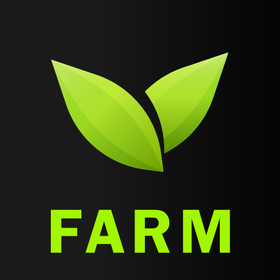
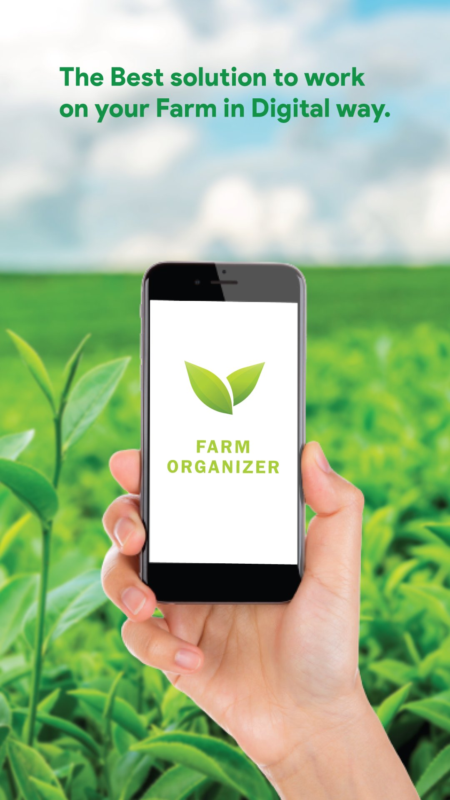
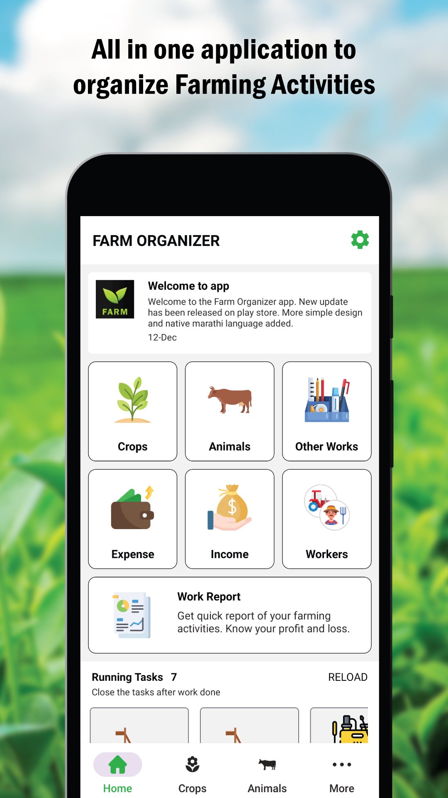
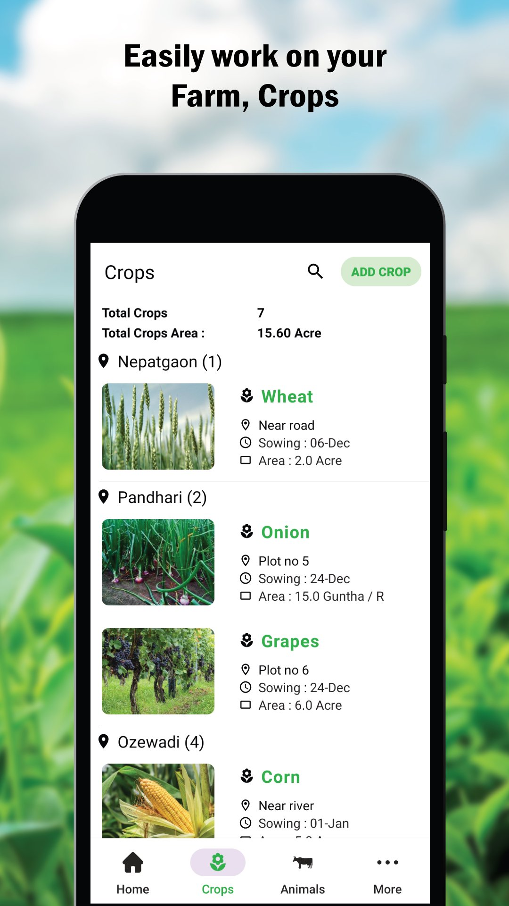
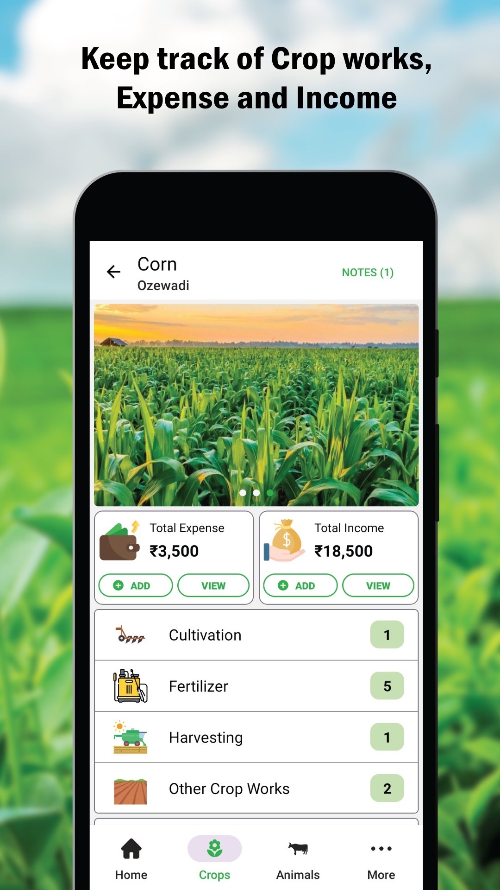
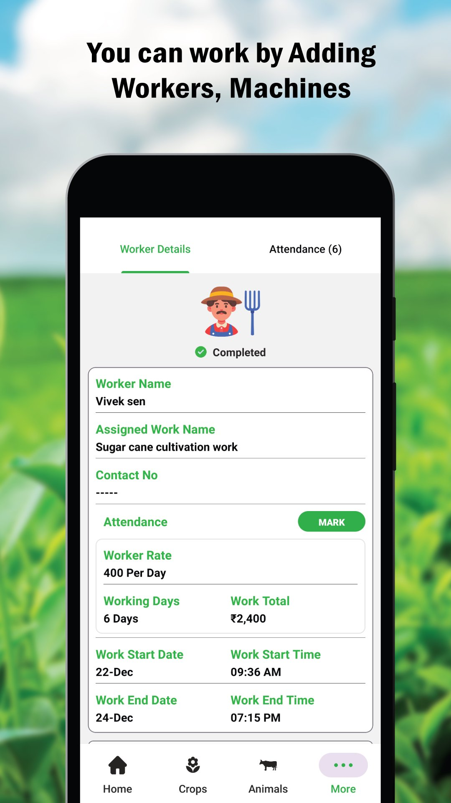
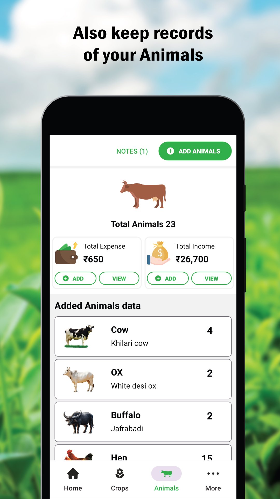
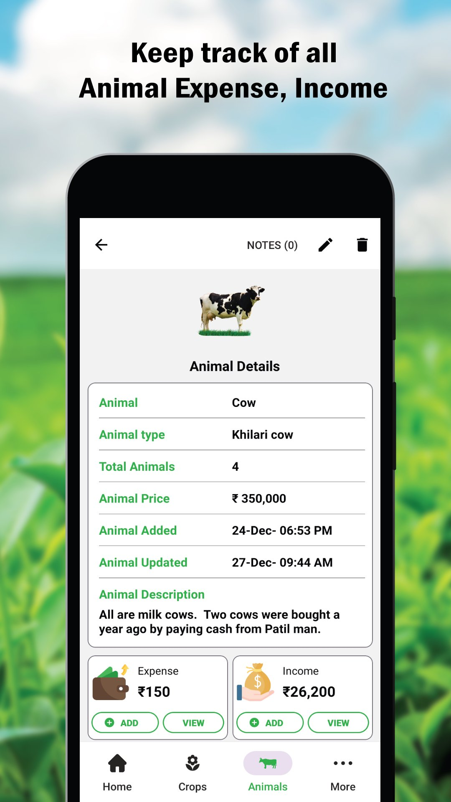

# Farm Organizer

Farm Organizer is an offline-first Android app built to help farmers manage crop and livestock workflows in one place.
It focuses on daily farm operations, basic financial tracking, and organized records for better decision-making.

## Overview

The project is designed to make farm operations easier to track digitally:

- Track crop activities such as cultivation, fertilizer usage, and harvest progress
- Record income and expenses to understand farm-level profit and loss
- Maintain structured livestock records with related activity logs
- Work reliably with a resilient offline-first architecture

## App Preview

### App Logo

### Screenshots

| | |
|---|---|
|  |  |
|  |  |
|  |  |
|  |  |

## Download

Download the latest app release from GitHub:

- [Farm Organizer Releases](https://github.com/godus3r/Farm-organizer/releases)
- [Farm Organizer on APKPure](https://apkpure.com/farm-organizer/com.farmorganizer)

## Tech Stack

- Android Native
- Java and Kotlin
- Local Database
- Cloud Storage

## Live Project Page

- Open the project showcase page: `project.html`
